# 1800 · Omarchy 4

A pixel art theme for Omarchy inspired by nineteenth-century cities, steam travel and harbors in the mist.

## Backgrounds

Twelve wallpapers, all native 3840 × 2160. Click a preview to open the full-resolution PNG.

| | | |
| --- | --- | --- |
| [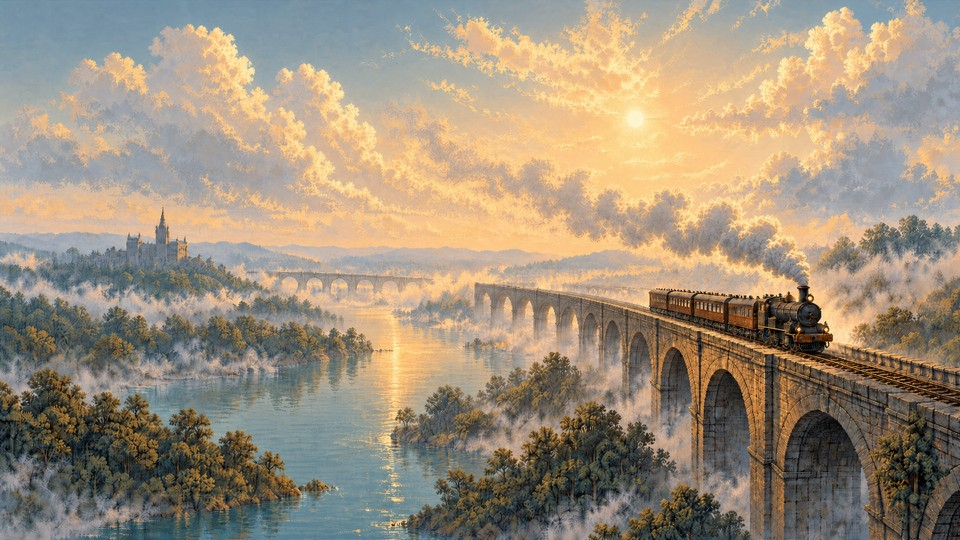](backgrounds/01-rain-steam-speed.png)<br>Rain, Steam and Speed | [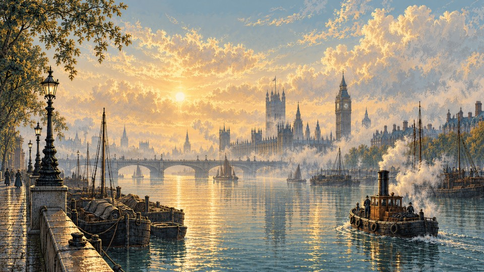](backgrounds/02-london-thames.png)<br>London — Thames | [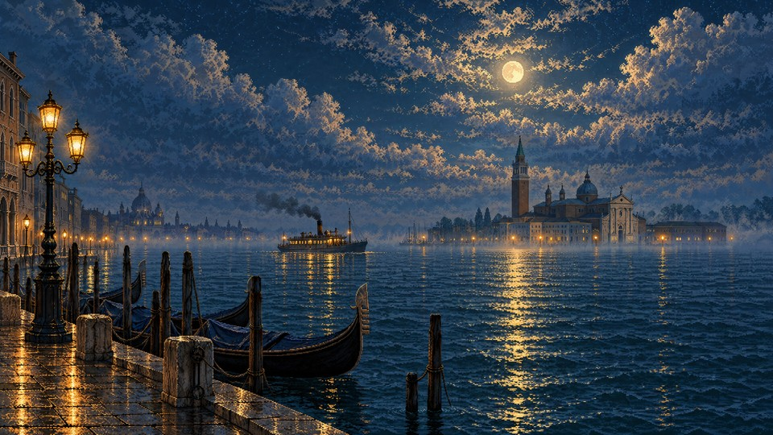](backgrounds/03-venezia.png)<br>Venezia |
| [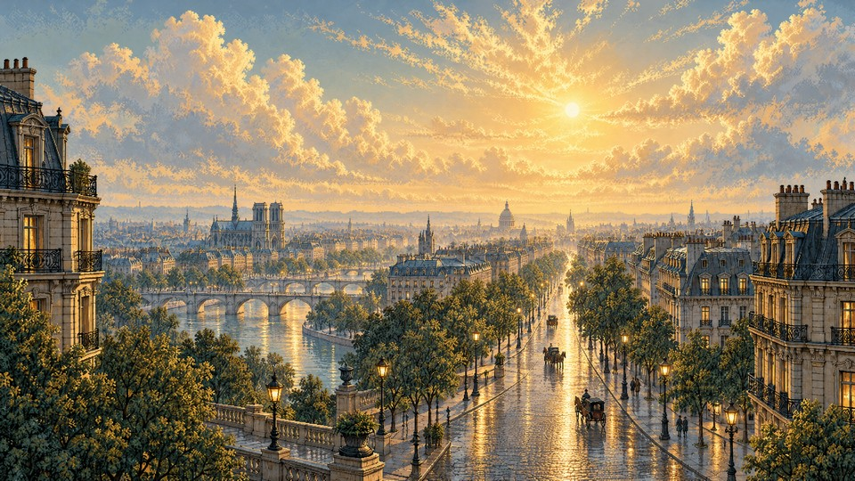](backgrounds/04-paris-boulevard.png)<br>Paris — Boulevard | [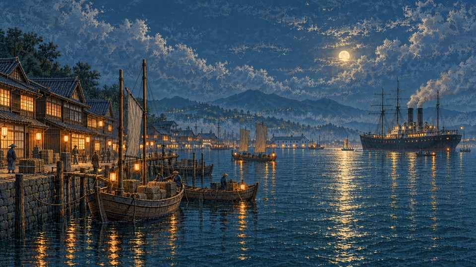](backgrounds/05-yokohama.png)<br>Yokohama | [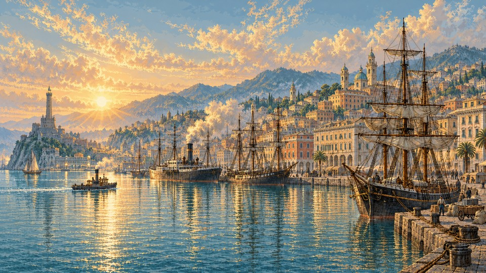](backgrounds/06-genova.png)<br>Genova |
| [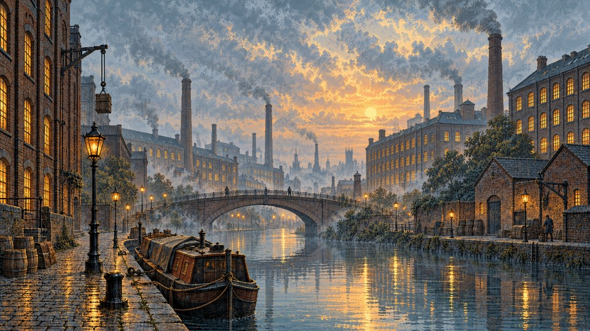](backgrounds/07-manchester.png)<br>Manchester | [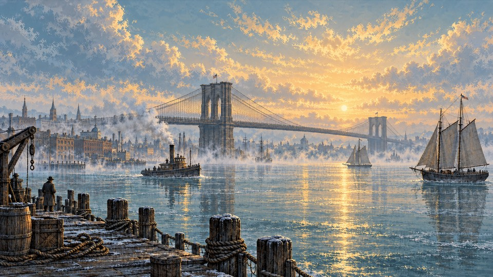](backgrounds/08-new-york.png)<br>New York — East River | [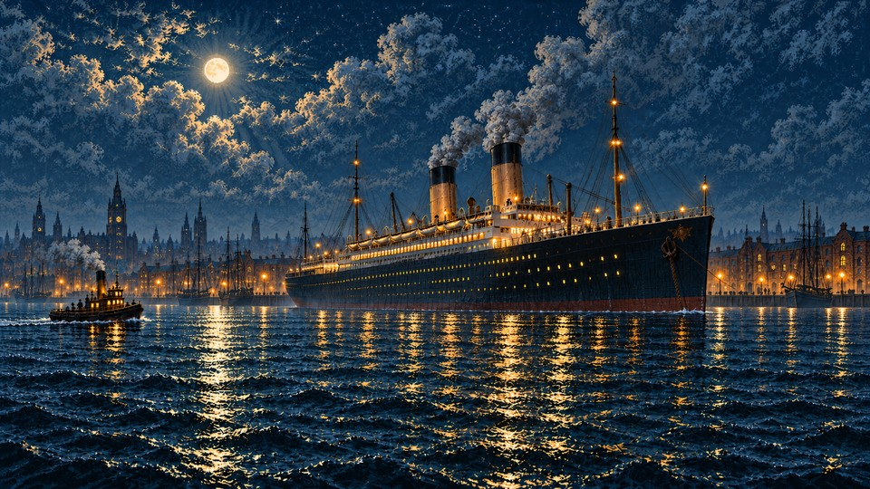](backgrounds/09-liverpool.png)<br>Liverpool |
| [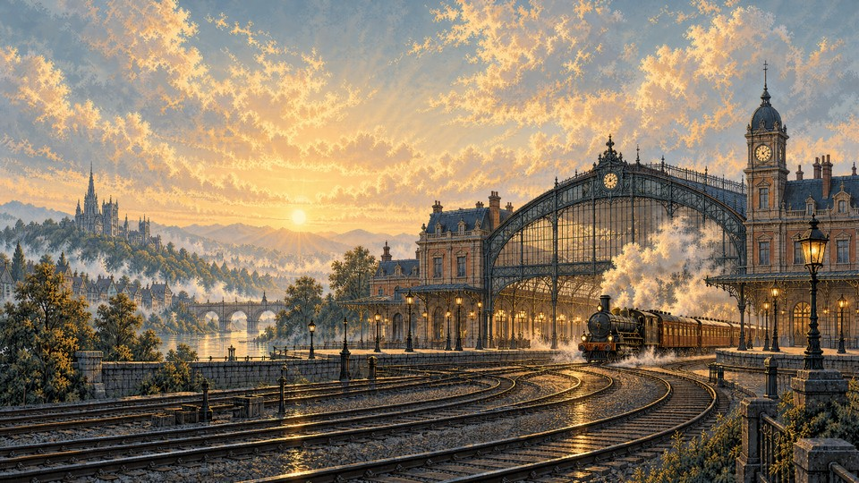](backgrounds/10-steam-station.png)<br>Steam Station | [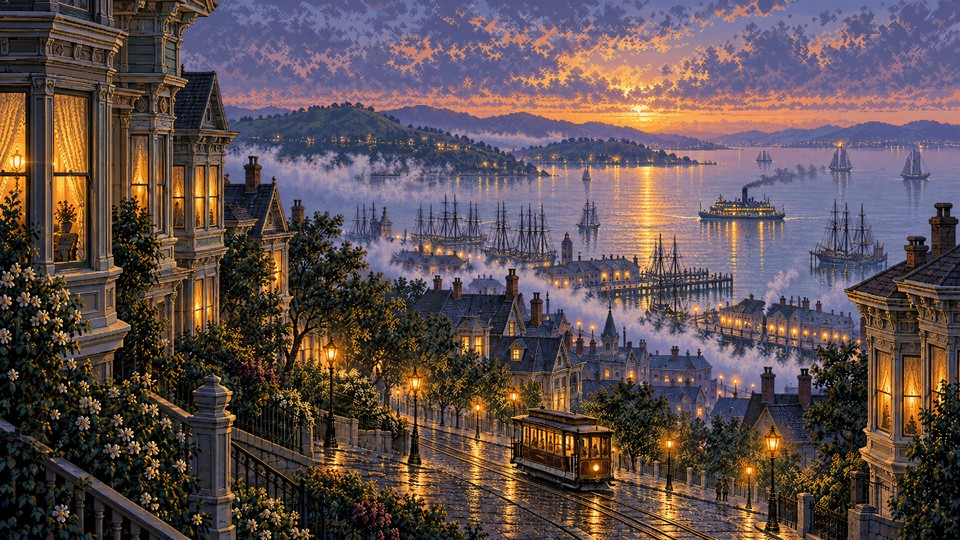](backgrounds/11-san-francisco.png)<br>San Francisco | [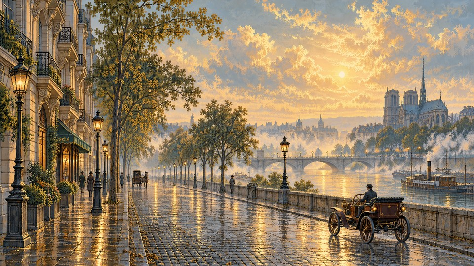](backgrounds/12-paris-motorcars.png)<br>Paris — Motorcars |


[Scene prompts and generation settings](docs/prompts/README.md) are included.

## Inspiration

Steam trains, sailing ships, gas lamps and early motorcars connect cities across Europe, Japan and America. Golden daylight and blue nights share the same painterly pixel art style, inspired by Rain, Steam and Speed by Joseph Mallord William Turner.

## Installation

Run on your Omarchy 4 machine:

```sh
omarchy-theme-install https://github.com/simoz/omarchy-1800-theme
```

To switch back, select your previous theme from Omarchy's theme menu.

## Shell

Dark green surfaces, parchment text and brass borders carry through the bar, menus, launcher and dialogs. Selected rows use a muted sage background. Shell surfaces are opaque; personal settings can override them.

## Palette

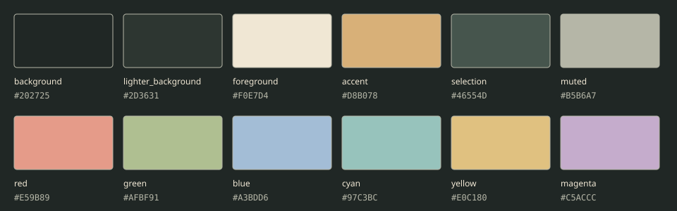

| Role | Color |
| --- | --- |
| Ink background | `#202725` |
| Surfaces | `#2D3631` |
| Parchment text | `#F0E7D4` |
| Brass accent | `#D8B078` |
| Sage selection | `#46554D` |
| Secondary text | `#B5B6A7` |

`colors.toml` contains the theme palette, including bright terminal variants. `icons.theme` selects `Yaru-wartybrown`.

Opaque-color contrast: primary text **12.40:1** on the background; primary text **6.41:1** on selection; secondary text **6.07:1** on lighter surfaces. The eight semantic terminal colors exceed **4.5:1** on the main background. Transparency and application customizations may change these results.

## Compatibility

Uses the Omarchy 4 central palette and `shell.toml`.

## Image credits

Artwork created with OpenAI image generation. Wallpapers are native 3840 × 2160, with no post-generation upscaling. Gallery previews are reduced copies.

## License

See the [MIT License](LICENSE).
