# 1800 · Omarchy 4

**Twelve paintings. A century of light.**

A theme inspired by nineteenth-century painting: parchment text, deep green-black ink, aged brass and botanical sage. Twelve selected paintings reinterpreted as detailed pixel-art desktop wallpapers.

## Status

Twelve native 3840 × 2160 PNG wallpapers are included. Palette and shell colors pass the automated contrast checks. Live validation on an Omarchy desktop is still pending.

## Wallpapers

Twelve original API outputs, generated at 3840 × 2160 with no upscaling. Click a thumbnail for the full PNG.

| | | |
| --- | --- | --- |
| [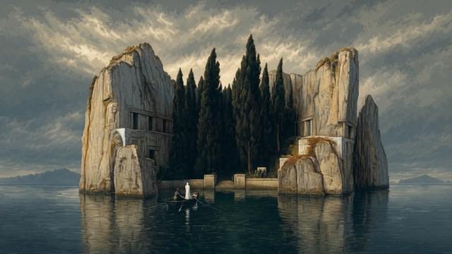](backgrounds/01-isle-of-the-dead.png)<br>Arnold Böcklin — Isle of the Dead, 1883 | [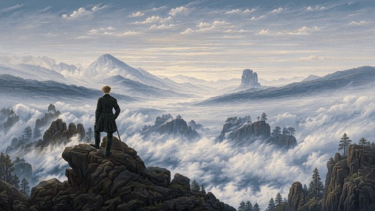](backgrounds/02-wanderer.png)<br>Caspar David Friedrich — Wanderer Above the Sea of Fog | [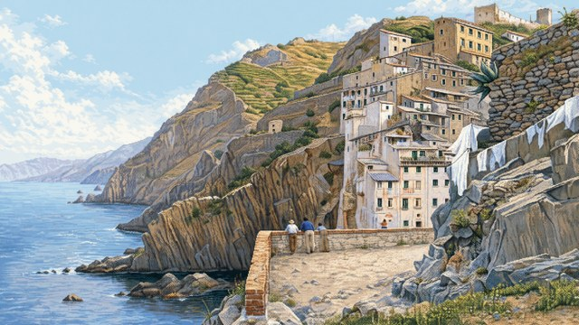](backgrounds/03-riomaggiore.png)<br>Telemaco Signorini — Riomaggiore |
| [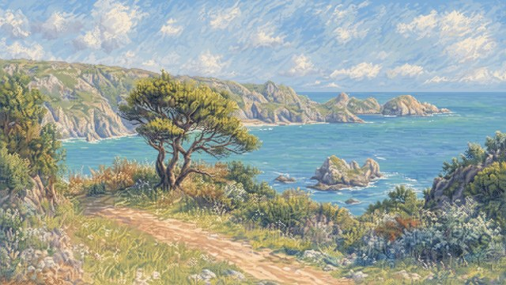](backgrounds/04-guernsey.png)<br>Pierre-Auguste Renoir — Veduta di Guernsey, 1883 | [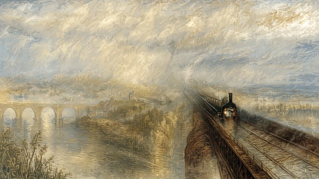](backgrounds/05-rain-steam-speed.png)<br>Turner — Rain, Steam and Speed | [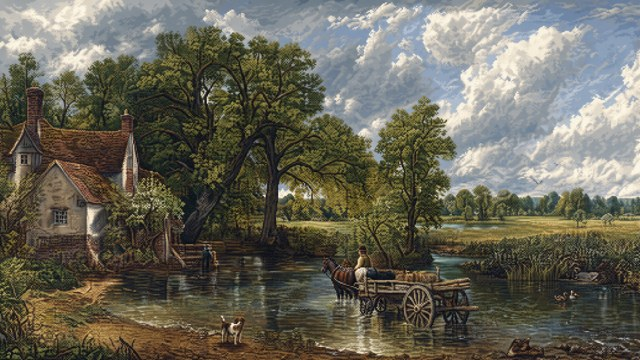](backgrounds/06-hay-wain.png)<br>Constable — The Hay Wain |
| [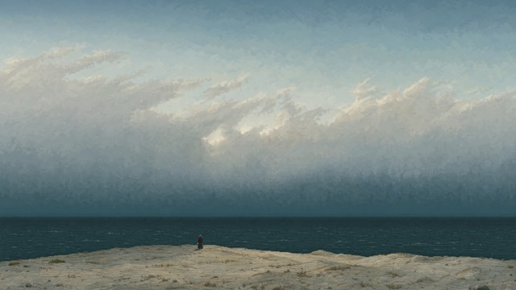](backgrounds/07-monk-by-the-sea.png)<br>Friedrich — The Monk by the Sea | [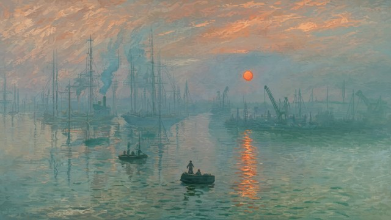](backgrounds/08-impression-sunrise.png)<br>Monet — Impression, Sunrise | [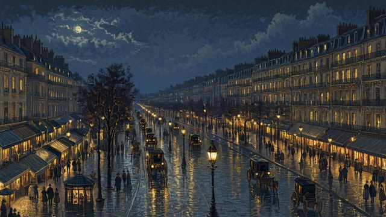](backgrounds/09-boulevard-at-night.png)<br>Camille Pissarro — Boulevard Montmartre at Night |
| [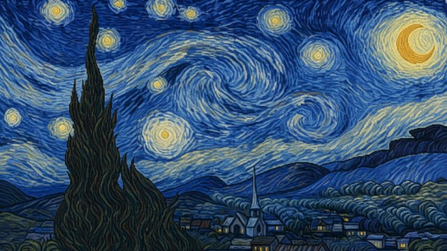](backgrounds/10-starry-night.png)<br>Van Gogh — The Starry Night | [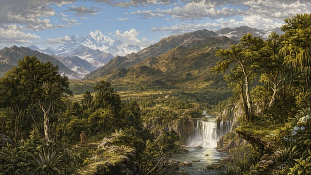](backgrounds/11-heart-of-the-andes.png)<br>Church — The Heart of the Andes | [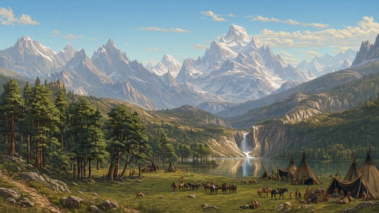](backgrounds/12-landers-peak.png)<br>Bierstadt — The Rocky Mountains, Lander’s Peak |

## Installation

```sh
omarchy-theme-install https://github.com/simoz/omarchy-1800-theme
```

Requires Omarchy 4. Personal shell or application overrides can change colors and opacity. Switch themes through the standard Omarchy theme menu.

## Palette


| Role | Color |
| --- | --- |
| Background — ink | `#202725` |
| Surfaces | `#2D3631` |
| Foreground — parchment | `#F0E7D4` |
| Accent — aged brass | `#D8B078` |
| Selection — sage | `#46554D` |
| Secondary text | `#B5B6A7` |

Shell panels, menus and dialogs use opaque backgrounds. Terminal opacity and personal application overrides remain user settings. Contrast figures describe the shipped opaque colors, not arbitrary transparent windows.

Primary text: **12.40:1**; selected text: **6.41:1**; secondary text on surfaces: **6.07:1**. All **55** tested text/surface pairs exceed **4.5:1** (minimum **5.57:1**). See [the contrast report](docs/contrast.json); reproduce with `python3 scripts/check-theme.py`.

## Artwork

The final selection and original-source links are recorded in [the artwork manifest](docs/backgrounds.json). Generated wallpapers are reinterpretations, not reproductions or scans of the paintings. No text, logos or frames appear in wallpapers.

## Compatibility

Targets the Omarchy 4 central `colors.toml` format and `shell.toml` surfaces, checked against the official `quattro` templates. Live desktop testing on Omarchy is still required; this repository is being prepared on macOS.

## Generation

OpenAI Image API, `gpt-image-2`, high quality, explicit native 3840 × 2160 PNG. Accepted files are copied unchanged; no upscaling. Exact prompts are saved in `docs/prompts/`. Lower-resolution experiments are excluded from the wallpaper pack.

## License

MIT for the theme files and generated assets to the extent rights apply. Original artwork references retain their source attributions; original reference files are not distributed here.

## Selected paintings

1. Arnold Böcklin — [Isle of the Dead, 1883](https://commons.wikimedia.org/wiki/File:Arnold_Boecklin_-_Island_of_the_Dead,_Third_Version.JPG)
2. Caspar David Friedrich — [Wanderer Above the Sea of Fog](https://en.wikipedia.org/wiki/Wanderer_Above_the_Sea_of_Fog)
3. Telemaco Signorini — [Riomaggiore](https://commons.wikimedia.org/wiki/File:View_of_the_village_of_Riomaggiore_(1892-94),_by_Telemaco_Signorini.jpg)
4. Pierre-Auguste Renoir — [Veduta di Guernsey, 1883](https://commons.wikimedia.org/wiki/File:Pierre-Auguste_Renoir_-_View_at_Guernsey_-_1955.601_-_Clark_Art_Institute.tiff)
5. Turner — [Rain, Steam and Speed](https://en.wikipedia.org/wiki/Rain%2C_Steam_and_Speed_%E2%80%93_The_Great_Western_Railway)
6. Constable — [The Hay Wain](https://en.wikipedia.org/wiki/The_Hay_Wain)
7. Friedrich — [The Monk by the Sea](https://en.wikipedia.org/wiki/The_Monk_by_the_Sea)
8. Monet — [Impression, Sunrise](https://en.wikipedia.org/wiki/Impression%2C_Sunrise)
9. Camille Pissarro — [Boulevard Montmartre at Night](https://commons.wikimedia.org/wiki/File:Camille_Pissarro,_The_Boulevard_Montmartre_at_Night,_1897.jpg)
10. Van Gogh — [The Starry Night](https://en.wikipedia.org/wiki/The_Starry_Night)
11. Church — [The Heart of the Andes](https://en.wikipedia.org/wiki/The_Heart_of_the_Andes)
12. Bierstadt — [The Rocky Mountains, Lander’s Peak](https://en.wikipedia.org/wiki/The_Rocky_Mountains%2C_Lander's_Peak)
